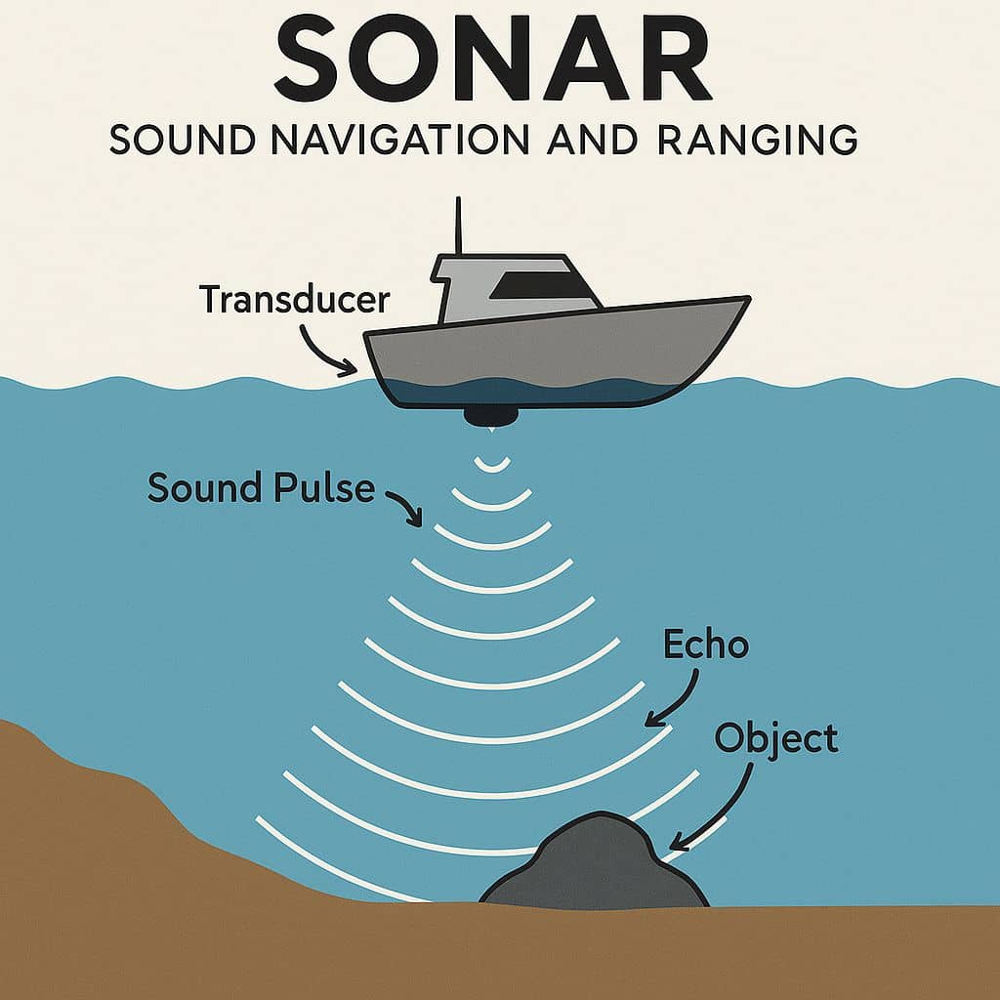
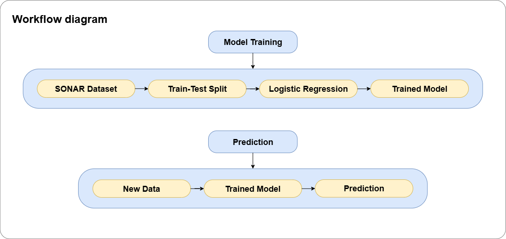

# Sonar Rock vs Mine Classifier

   


This project uses a **Logistic Regression** model to classify objects detected by [SONAR](https://en.wikipedia.org/wiki/Sonar) as either **rock** or **mine**. It’s a supervised machine learning project built with **scikit-learn**, designed for a naval defense scenario.


## 🛡 Mission Brief

<table>
<tr>
<td width="280">
  
</td>
<td>
  <p>
  The naval defense unit has tasked me with developing a system to help protect our submarines from hidden underwater threats. Enemy forces are suspected of planting mines along the ocean bed to destroy passing submarines. These mines often resemble harmless rocks on SONAR scans, making it extremely difficult for human operators to tell the difference in time.  
  </p>
  <p>
  My mission is to build a <strong>machine learning model</strong> that can analyze SONAR data and accurately determine whether a detected object is a <strong>mine</strong> or a <strong>rock</strong>. The goal is to give submarine crews a reliable, real-time decision-making tool that will allow them to navigate safely avoid dangerous zones, and protect both lives and critical military assets.
  </p>
</td>
</tr>
</table>


## 📊 Workflow Diagram




## 📂 Project Structure

```yaml
mine-vs-rock-prediction/
├── data/                                 # Dataset storage
│   └── sonar_data.csv                    # Sonar dataset
│
├── images/                               # Project images & diagrams
│   ├── sonar.jpg                         # Sonar concept image
│   └── workflow.png                      # Workflow diagram for README/report
│
├── model/                                # Saved ML models
│   └── sonar_model.pkl                   # Trained Logistic Regression model
│
├── notebooks/                            # Jupyter notebooks for experiments
│   └── rock_vs_mine_prediction.ipynb     # Development & exploration notebook
│
├── report/                               # Project reports & documentation
│   └── report.md                         # Detailed project report
│
├── scripts/                              # Python scripts for automation
│   ├── train_model.py                    # Train the Logistic Regression model
│   └── predict_with_model.py             # Make predictions with the saved model
│
├── .gitignore                            # Ignore unnecessary files in Git
├── LICENSE                               # License file
├── README.md                             # Main project documentation
└── requirements.txt                      # Python dependencies

```


## 🤖 How It Works

1. **Data Loading & Preparation**

    - The dataset `sonar_data.csv` contains 60 numerical features per object.
    - Each row is labeled as **"R"** (Rock) or **"M"** (Mine).
        
2. **Model Training** (`train_model.py`)

    - Splits the dataset into **training** (90%) and **test** (10%) sets.
    - Trains a **Logistic Regression** classifier.
    - Evaluates accuracy on both training and test sets.
    - Saves the trained model to `model/sonar_model.pkl` using `joblib`.
        
3. **Prediction** (`predict_with_model.py`)
    
    - Loads the saved model.
    - Accepts a new sonar reading (60 features) as input.
    - Outputs whether the object is predicted to be a **Rock** or a **Mine**.
        


## 📦 Requirements

Install dependencies with:

```bash
pip install -r requirements.txt
```

From `requirements.txt`:

```yaml
ipykernel==6.29.5
matplotlib==3.10.0
numpy==2.2.5
pandas==2.3.1 
scikit-learn==1.7.1
joblib==1.5.1
```


## 💻 Usage

### 1. Train the Model

```bash
cd scripts
python train_model.py
```

This will:

- Load `data/sonar_data.csv`.
- Train the model.
- Display accuracy metrics.
- Save the model to `model/sonar_model.pkl`.
    
### 2. Make a Prediction

Edit `predict_with_model.py` to replace `input_data` with your own 60-feature values, then run:

```bash
python predict_with_model.py
```

Example output:

```bash
------------------------------------
Loading model...
Model loaded successfully.
------------------------------------
Prediction: The object is a Rock :)
------------------------------------
```


## 📊 Dataset

- **Source:** UCI Machine Learning Repository — [_Connectionist Bench (Sonar, Mines vs. Rocks)_](http://archive.ics.uci.edu/dataset/151/connectionist+bench+sonar+mines+vs+rocks) dataset.
- **Features:** 60 sonar readings (numeric values).
- **Labels:** `"R"` (Rock) or `"M"` (Mine).
    

## 🛠 Future Improvements

- **Integrate with real-time SONAR feeds** so predictions can be made instantly during submarine operations.
- **Enhance model accuracy** by experimenting with advanced algorithms like Random Forests, Gradient Boosting, or Neural Networks.  
- **Implement feature scaling and noise reduction techniques** to handle variability in SONAR data collected in different ocean conditions.  
- **Develop a user-friendly dashboard** for submarine crews to view predictions, confidence scores, and threat alerts in real time.  
- **Incorporate anomaly detection** to flag suspicious patterns not previously seen in the training data. 
- **Optimize for low-latency performance** so the system can operate efficiently on onboard submarine hardware.
    

## 📜 License

This project is licensed under the [Apache 2.0 License](/LICENSE) — feel free to use and modify.